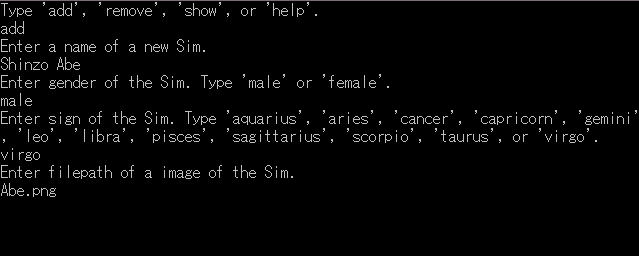
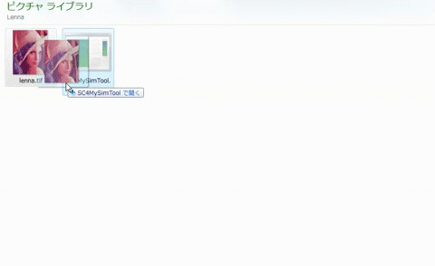

# SC4 My Sim Tool

A mod tool for SimCity 4.
You can add your original My Sims with custom images.

## Usage

### Without Commands

If you execute the application with no arguments, it prompts inputs in standard input.

### Commands

Command lines below are available.

`help`  
Show the help.

`show`  
Show the list of My Sims written in the DAT file.

`add <name> <gender> <sign> <image_path>`  
Add a new Sim to the list.  
`<image_path>` is absolute or relative.  
The image format must be JPG, PNG, GIF, EXIF, TIFF or BMP.

`remove <name>`  
Remove a specified Sim from the list and delete its image file.

### Drag and Drop

Drag and drop a image file to the exe to add a new Sim using its image.

### Gender Values

Type one of these to input gender.

- female
- male

### Sign Values

Type one of these to input sign.

- aquarius
- aries
- cancer
- capricorn
- gemini
- leo
- libra
- pisces
- sagittarius
- scorpio
- taurus
- virgo

## Notes

- The DAT file and images will be saved in `{MyDocuments}/SimCity 4/MySim`
- Information of Sims will be copied into each save of cities where the Sim lives except the bitmap.
- If you remove a Sim from the DAT file, the Sim remains in cities, but the image will be missing.
