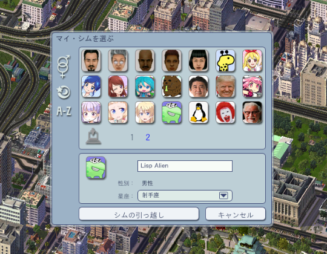

# SimCity 4 My Sim Tool

A mod tool for SimCity 4 to add your original My Sims with custom images

[Download the latest version](https://github.com/curegit/sc4-my-sim-tool/releases/latest)

## Features

- Make My Sims with custom images
- Edit My Sim list by removal and reordering
- Update images of existing My Sims

## Requirements

- Windows
- .NET Framework >= 4.8
- SimCity 4 Rush Hour/Deluxe (Tested with version 1.1.640 and 1.1.641)

## Installation

Not needed.
Just run the executable.

## Usage

### Commands

`help, -h, --help`  
Show help.

`show [-r, --reorder]`  
Show the My Sim list.  
Show indexes used for reordering when '-r' or '--reorder' is given.

`add <name> <gender> <sign> <image_path>`  
Add a new Sim to the list.  
The path of an image is absolute or relative.  
The image format must be JPG, PNG, GIF, EXIF, TIFF, or BMP.

`remove <index>`  
Remove a specified Sim from the list and delete its image file.  
Use 'show' command to see indexes.

`reorder <source_index> <destination_index>`  
Move a specified Sim to a given index position.  
Use 'show -r' to see indexes.

`update-image <index> <image_path>`  
Update the image of a specified existing Sim.  
Pass the path of a new image for the Sim.  
Use 'show' command to see indexes.

### Interactive Mode

If you execute the application with no command-line arguments, it prompts inputs in standard input.

### Drag and Drop

Drag and drop an image file to the executable to add a new Sim using its image.

### Gender Values

Type one of these to input gender.

- female
- male

### Sign Values

Type one of these to input sign.

- aquarius
- aries
- cancer
- capricorn
- gemini
- leo
- libra
- pisces
- sagittarius
- scorpio
- taurus
- virgo

### Image Format

The image format must be JPG, PNG, GIF, EXIF, TIFF, or BMP.
To preserve an aspect ratio, bear in mind that images are resized to 36x41 pixels automatically.

## Notes

- Data and images are saved in `{MyDocuments}/SimCity 4/MySim`.
- Information of Sims except images is copied into each saves of cities where the Sim lives.
- If you remove a Sim from the list, the in-game Sim remains in the cities, but their image will be missing.

## License

[The Unlicense](LICENSE)
